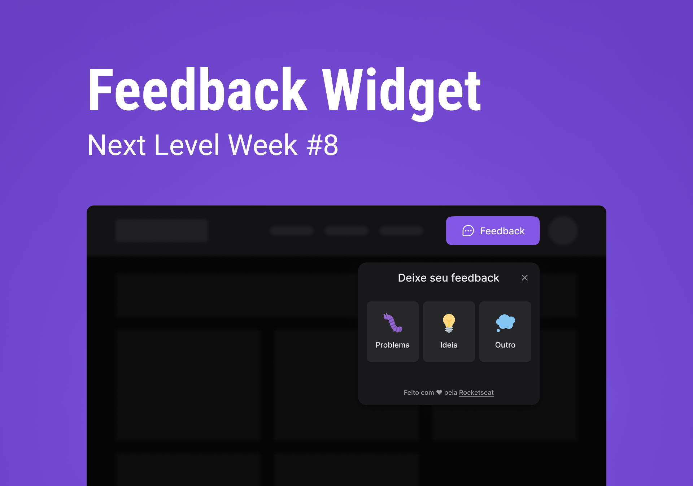

<div align="center"></div>

<div id='about'>
  <h1 align="center">
	  🚧  Feedback Widgte 🚀 In construction...  🚧
  </h1>
  <p align="center">🚀 It's an application developed to get feedback from user</p><br/>
</div>

Tabela de conteúdos
=================
<!--ts-->
   * [About](#about)
   * [How to run](#how-to-run)
      * [Requirements](#requirements)
   * [Tecnologies](#technologies)
   * [Features](#features)
   * [Features By Me](#featuresByMe)
   * [Learnings](#learnings)
   * [Author](#author)
<!--te-->

## Getting Started

<div id='hot-to-run'>
  <h2>How to run</h2>

  <div id='requirements' display='flex' flex-direction='column'>
    <h3>To run this application you need to install:</h3>
    - [NodeJS](https://nodejs.org/)<br/>
    - [Git](https://git-scm.com/)<br/>
    - Além disto é bom ter um editor para trabalhar com o código como [VSCode](https://code.visualstudio.com/)
  </div>
  
  <br/>

  First, download this repository to your machine:

  ```bash
  git clone https://github.com/flvSantos15/feedback-widget.git
  ```
  
  Go to the folder:
  
  ```bash
  cd folder's name
  ```

  Then, install dependencies by running:
  ```bash
  yarn
  # or
  npm install
  ```

  And finally, run the development server:

  ```bash
  npm run dev
  # or
  yarn dev
  ```

  Open [http://localhost:3000](http://localhost:3000) with your browser to see the result.
 </div>

<div id='technologies'>
  <h2>This application is being built using the following technologies:</h2>
  
  - [React](https://pt-br.reactjs.org/)
  - [TypeScript](https://www.typescriptlang.org/)
  - [Tailwindcss](https://tailwindui.com)
  - [Headless](https://headlessui.dev/)
  - [Phosphor](https://phosphoricons.com/)
</div>

<div id='features'>
  <h2>Features developed during the classes</h2>

  - [  ] Web view
  - [  ] Mobile view
  - [  ] dark and light mode
  
</div>

<div id='featuresByMe'>
  <h2>Features developed by me</h2>

  - [  ] Web view
  - [  ] Mobile view
  - [  ] dark and light mode
  
</div>

<div id='learnings'>
  <h2>Learnings</h2>
  
  <li>Phosphor icons let me add stiles to the icons as I want, like weight, widht, outline color, and much more.</li>
  <li>Headlessui let me add acessibility for my application, like tab and esc functionality, a text when the user hovers something.</li>
</div>

<div id='author'>
  <h2>Autor</h2>

 
 <br />
 <sub><b>Flavio Santos</b></sub>


Built with ❤️ by Flavio Santos 👋🏽 get in touch!

[](https://www.linkedin.com/in/flvSantos15/) 
[](mailto:flvSantos300@gmail.com)
</div>
